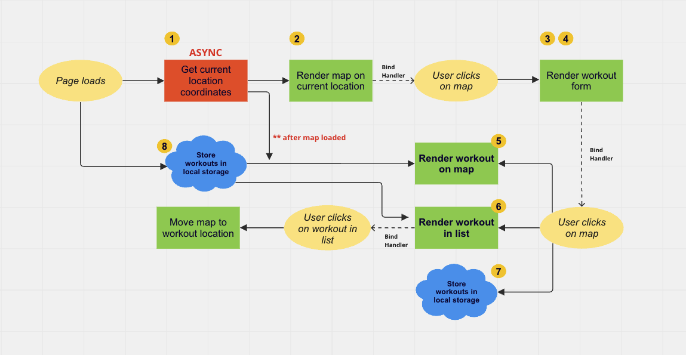

# Mapty

## created by: Victor Williams

---

#### User Stories & Features

==1. Log my running workouts with location, distance, time, pace and steps/minute==

> Map where user clicks to add new workout (best way to get location coordinates)
> Geolocation to display map at current location (more user friendly)
> Form to input distance, time, pace, steps/minute

== 2. Log my cycling workouts with location, distance, time, speed and elevation gain ==

> Form to input distance, time, speed, elevation gain

==3. See all my workouts at a glance==

> Display all workouts in a list

==4. See my workouts on a map==

> Display all workouts on a map

==5. See all my workouts when I leave the app and come back later==

> Store workout data in the browser using local storage AP > On page load, read the saved data from local storage and display

---

#### Vizualizing Stories & Features

